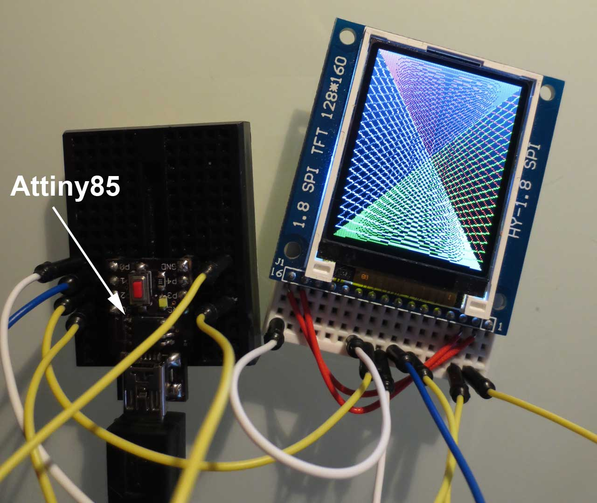

uTFT-ST7735
===========

This is a size and speed optimized ANSI-C library to control 1.8" ST7735 TFTs. This library is based on the "china_lcd" library by Tobias Weis, which is in turn based
on the Adafruit ST7735 Arduino Library. Compared to the original, the memory requirement has been drastically reduced and the speed has been improved. 
Allowing it to be used on smaller devices such as the ATtiny85. It includes a speed-optimzed software-SPI implementation that
is more than twice as fast as the original implementation.

[Article by Tobias Weis] (http://enerds.eu/blog/18-spi-lcd-display-10-eur-with-atmega.html)
 
[Github repository of the Adafruit lib] (https://github.com/adafruit/Adafruit-ST7735-Library)
 
The library works with my display, which may be a "red" flag one. Modifications are possibly required for other versions.

### Modifications to the original library

 * Removal of all circle functions. 
 * Only text size 1 is available.
 * Only ASCII characters 32-128 are available. These are sufficient for normal english text and data display.
 * Removal of bitmap functions. These can be easily implemented in the user program.
 * Added speed optimized software SPI.
 * Colour conversion is now done by macro.
 * Reordered and speed optimized text printing function.
 * Minor size optimizations to all functions. 

The example compiles to only 2842 bytes, leaving ample space for additional functionality on the ATTiny85.

### Test setup 
 
 
# History

 
 * v0.1 2013/10/06 - Initial release cpldcpu@gmail.com
 
